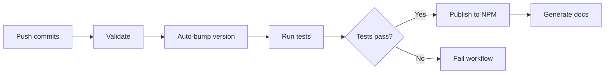

# Contributing to nestjs-backend-common

## Automated Version Bumping

**⚠️ Important: Manual version bumps are NOT allowed!**

Versions are automatically bumped based on [Conventional Commit](https://www.conventionalcommits.org/) messages. When you push commits to the `main` branch, the CI/CD pipeline analyzes your commit messages and automatically:

1. Determines the appropriate version bump
2. Updates `package.json`
3. Creates a git tag
4. Publishes to NPM (if tests pass)

## Commit Message Format

Use the following format for your commit messages:

```
<type>: <description>

[optional body]

[optional footer]
```

### Commit Types and Version Bumps

| Commit Type                                       | Version Bump              | Example                    |
| ------------------------------------------------- | ------------------------- | -------------------------- |
| `fix:`                                            | **PATCH** (1.1.0 → 1.1.1) | Bug fixes                  |
| `feat:`                                           | **MINOR** (1.1.0 → 1.2.0) | New features               |
| `feat!:` or `BREAKING CHANGE:`                    | **MAJOR** (1.1.0 → 2.0.0) | Breaking changes           |
| `docs:`, `chore:`, `style:`, `refactor:`, `test:` | **No bump**               | Documentation, maintenance |

## Examples

### Patch Release (Bug Fix)

```bash
git commit -m "fix: correct correlation ID header handling"
```

Result: `1.1.0` → `1.1.1`

### Minor Release (New Feature)

```bash
git commit -m "feat: add new email validation decorator"
```

Result: `1.1.0` → `1.2.0`

### Major Release (Breaking Change) - Option 1

```bash
git commit -m "feat!: change logger interface signature"
```

Result: `1.1.0` → `2.0.0`

### Major Release (Breaking Change) - Option 2

```bash
git commit -m "feat: redesign configuration module

BREAKING CHANGE: Configuration now requires explicit initialization call"
```

Result: `1.1.0` → `2.0.0`

### No Release (Maintenance)

```bash
git commit -m "chore: update dependencies"
git commit -m "docs: fix typo in README"
git commit -m "test: add more test cases"
```

Result: No version change

## Multiple Commits

If you push multiple commits at once, the **highest** version bump will be applied:

```bash
git commit -m "fix: correct validation logic"
git commit -m "feat: add new utility function"
git commit -m "chore: update documentation"
git push
```

Result: `1.1.0` → `1.2.0` (minor bump from `feat:` takes precedence)

## Why No Manual Version Bumps?

Manual version bumps are prevented to ensure:

- ✅ Consistent and predictable versioning
- ✅ Clear version history with git tags
- ✅ Automatic changelog generation (future feature)
- ✅ Alignment between commit messages and versions

If you try to manually change the version in `package.json`, the CI/CD pipeline will fail with a clear error message.

## What Happens When You Push?

1. **Validation**: CI checks if version was manually changed (fails if true)
2. **Analysis**: CI analyzes commits since last tag
3. **Bump**: CI automatically bumps version based on commit types
4. **Tag**: CI creates a git tag (e.g., `v1.2.0`)
5. **Test**: CI runs linting and unit tests
6. **Publish**: CI publishes to NPM (if version changed and tests pass)
7. **Docs**: CI generates and commits documentation

## Workflow Summary



## Best Practices

1. **Write descriptive commit messages** that clearly explain what changed
2. **Use the correct commit type** to ensure proper version bumping
3. **Group related changes** in a single commit when possible
4. **Test locally** before pushing to avoid failed CI runs
5. **Use `BREAKING CHANGE:`** in the commit body or `!` after type for breaking changes

## Questions?

If you have questions about the versioning system, please open an issue in the repository.
